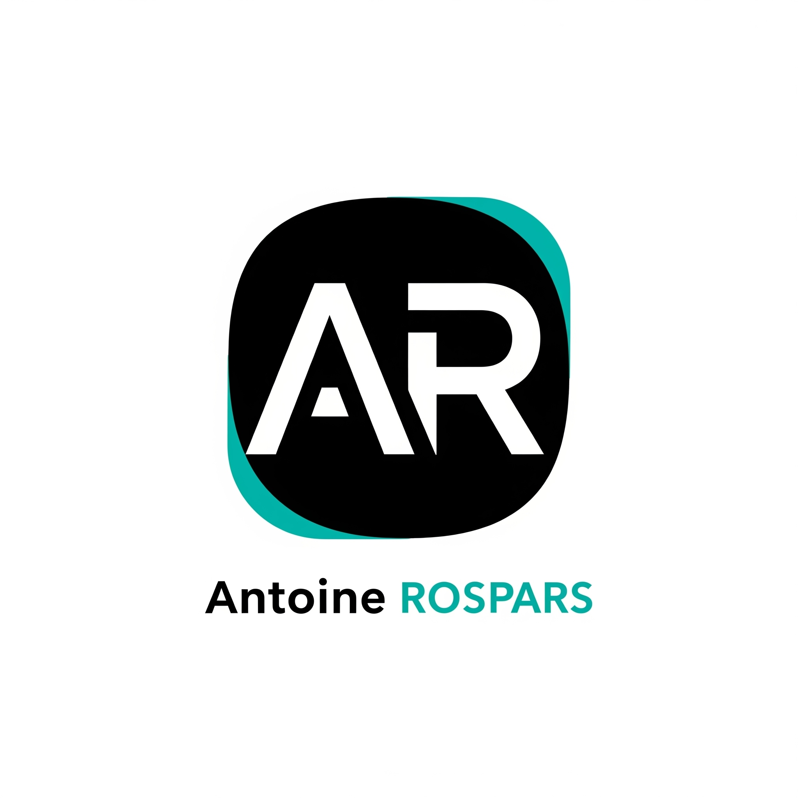

# Portfolio – Antoine ROSPARS

<!-- Logo -->
<div align="center">

</div>
<br/>

<div align="center">

[](https://app.netlify.com/projects/arospars-portfolio/deploys)
[](https://github.com/P4ST4S/portfolio-v4/actions/workflows/CI.yml)

</div>

## 🧰 Technologies utilisées

<div align="center">
    
    
    
    
</div>

---

## 🚀 Présentation

Portfolio moderne, responsive et performant pour valoriser le profil d’Antoine ROSPARS (moi), développeur fullstack passionné.

- **Stack** : React, TypeScript, TailwindCSS, Vite
- **Déploiement** : Netlify, CI/CD GitHub Actions
- **Design** : Minimaliste, élégant, adapté mobile

---

## 🔗 Démo

👉 [Voir le site en ligne](https://antoinerospars.dev)

---

## 📦 Installation

```bash
pnpm install
pnpm run dev
```

---

## 🛠️ Scripts

- `pnpm run dev` : lance le serveur de dev
- `pnpm run build` : build production
- `pnpm run lint` : lint du code

---

## ⚙️ CI/CD

- **Netlify** : déploiement automatique à chaque push sur `main`
- **GitHub Actions** : lint + build sur chaque PR et push

---

## 📚 Projets mis en avant

Retrouvez tous les projets dans la section dédiée du site.

---

## 👤 Auteur

**Antoine ROSPARS**  
[GitHub](https://github.com/P4ST4S) · [LinkedIn](https://www.linkedin.com/in/antoinerospars/)

---

## Licence

MIT
